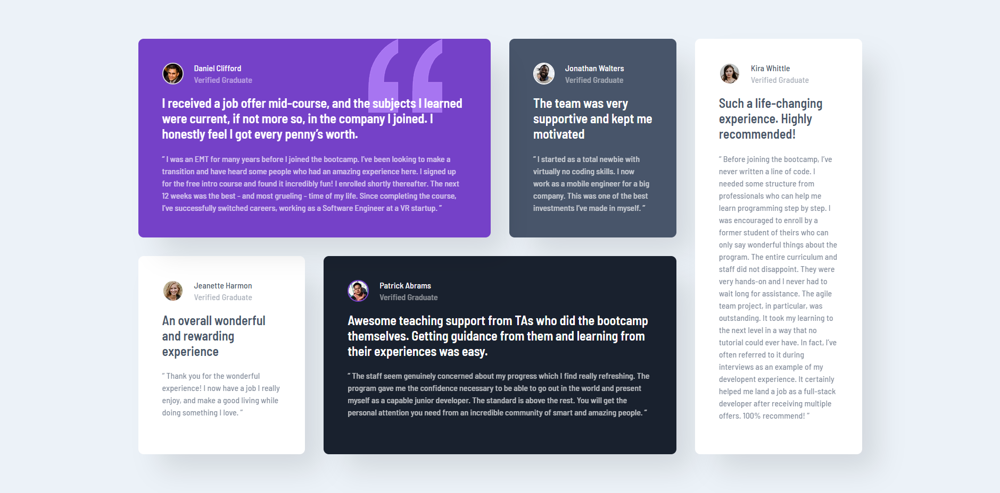
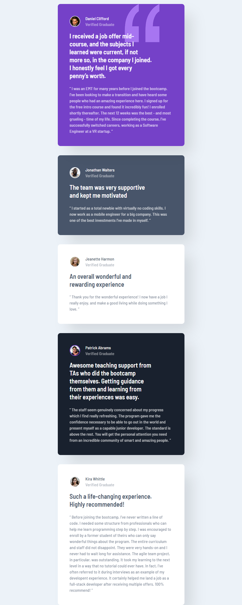

# Frontend Mentor - Testimonials grid section solution

This is a solution to the [Testimonials grid section challenge on Frontend Mentor](https://www.frontendmentor.io/challenges/testimonials-grid-section-Nnw6J7Un7). Frontend Mentor challenges help you improve your coding skills by building realistic projects.

## Table of contents

- [Overview](#overview)
  - [The challenge](#the-challenge)
  - [Screenshot](#screenshot)
  - [Links](#links)
- [My process](#my-process)
  - [Built with](#built-with)
  - [What I learned](#what-i-learned)
- [Author](#author)

**Note: Delete this note and update the table of contents based on what sections you keep.**

## Overview

### The challenge

Users should be able to:

- View the optimal layout for the site depending on their device's screen size

### Screenshot




### Links

- Solution URL: [Solution URL](https://github.com/TrEv0rRrRr/testimonials-grid-section-main)
- Live Site URL: [Live site URL](https://trev0rrrrr.github.io/testimonials-grid-section-main/)

## My process

### Built with

- Semantic HTML5 markup
- CSS custom properties
- Flexbox
- CSS Grid

### What I learned

```css
@media screen and (max-width: 1365px) {
  .container {
    display: flex;
    max-width: 30rem;
    justify-content: center;
    margin: 15px;
  }
}

@media screen and (max-width: 1365px) {
  main {
    display: grid;
    grid-template-areas:
      "daniel"
      "jon"
      "jeanette"
      "patrick"
      "kira";
    grid-template-columns: 1fr;
  }

  .main__div-daniel {
    grid-area: daniel;
  }

  .main__div-jon {
    grid-area: jon;
  }

  .main__div-jeanette {
    grid-area: jeanette;
  }

  .main__div-patrick {
    grid-area: patrick;
  }

  .main__div-kira {
    grid-area: kira;
  }

  .quote_img {
    position: absolute;
    top: 0;
    left: 254px;
    width: 8.2rem;
    height: 9rem;
  }

  .publication__p_title {
    font-size: 1.5rem;
    line-height: 30px;
    padding-right: 78px;
  }
}
```

## Author

- Frontend Mentor - [@TrEv0rRrRr](https://www.frontendmentor.io/profile/TrEv0rRrRr)
